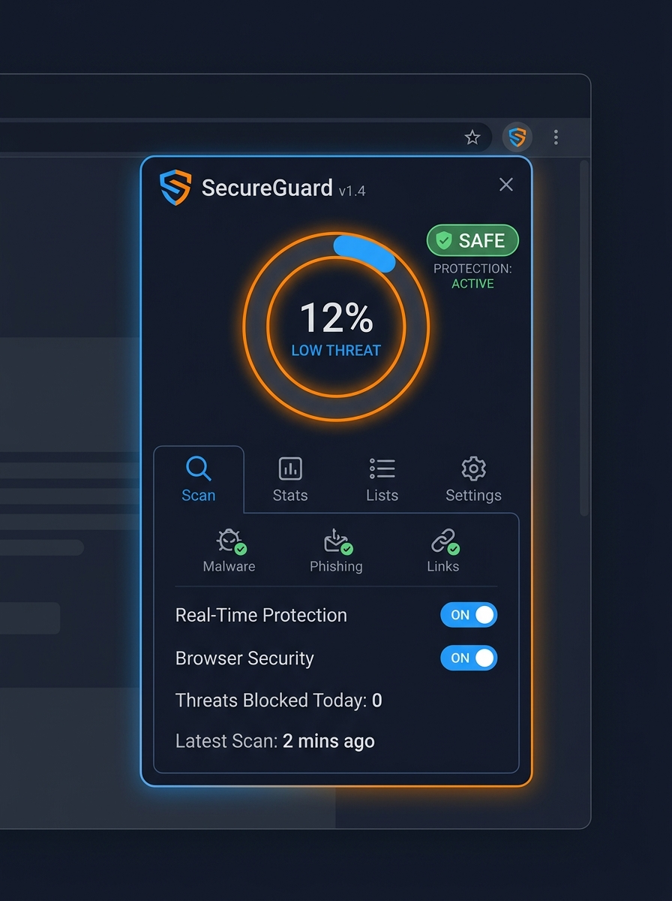
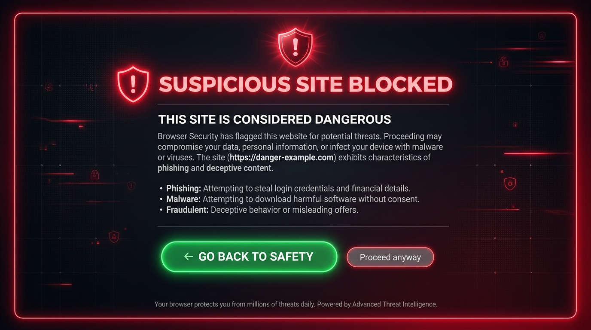
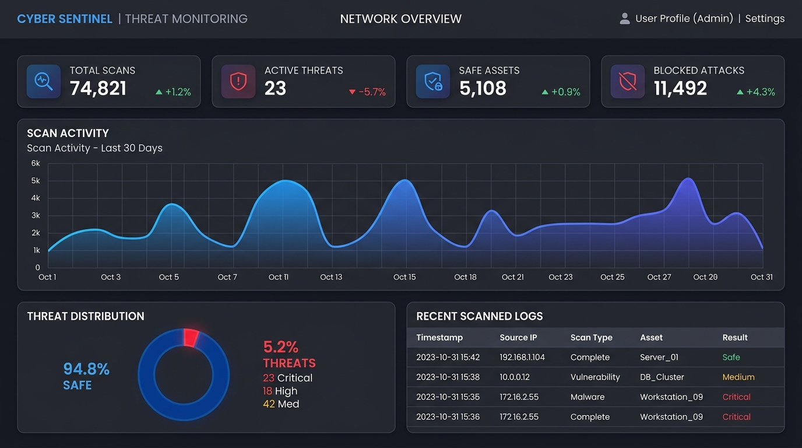
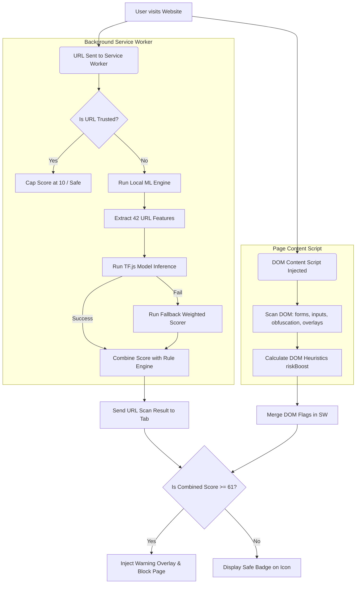

# AI Phishing Website Detection (AI Phishing Shield)

AI Phishing Shield is an advanced, zero-server, privacy-first browser extension that detects phishing sites, predicts zero-day attacks, explains threats transparently, and detects fake login forms using client-side Machine Learning (TensorFlow.js) and 15 robust DOM heuristic checks.

---

## 📸 Visual Preview

| Extension Popup | Warning Block Page |
| :---: | :---: |
|  |  |

| Standalone Analytics Dashboard |
| :---: |
|  |

---

## 🌟 Key Features

1. **Local ML Inference (TensorFlow.js)**: Runs a 5-layer neural network directly in the browser's service worker context. If loading the neural network fails, it gracefully falls back to a weighted linear model.
2. **Explainable AI**: Lists exactly why a site is flagged by displaying contributing feature scores and DOM heuristic flags in a dark-themed popup.
3. **Advanced DOM Scanning**: Analyzes 15 different page structural features in real-time, including cross-origin form actions, brand logo spoofing, anti-inspection methods (disabling right-click/copy), hidden fields, and clickjacking/iframe overlays. Handles SPAs using a `MutationObserver`.
4. **High-Risk Warning Overlay**: Blocks dangerous sites using a full-screen backdrop, an animated SVG gauge, a threat breakdown, a 5-second proceed lock, and a 15-second countdown returning the user to safety.
5. **Interactive Web Dashboard**: A fully featured standalone analytics dashboard using Chart.js to show scan trends, threat heatmaps, paginated scan history, and allow/block domain management.
6. **Robust ML Training Pipeline**: Python scripts to download verified datasets (PhishTank & Tranco), train a mirror network, plot model performance, and export the trained model for browser use.

---

## ⚙️ Architecture Flow



---

## 📂 Project Structure

```
AI Phishing Detection/
├── assets/                          # UI Mockups & Visuals
│   ├── popup_mockup.jpg
│   ├── dashboard_mockup.jpg
│   └── warning_overlay.jpg
├── extension/                       # Chrome Extension Source
│   ├── manifest.json                # MV3 Manifest with permissions & CSP
│   ├── privacy.html                 # Offline privacy policy for CWS approval
│   ├── background/
│   │   └── service-worker.js        # Lazy TF.js load, history, stats, lists API
│   ├── content/
│   │   ├── content.js               # 15 DOM checks, MutationObserver, overlay loader
│   │   ├── overlay.js               # In-page blocking UI, countdown, proceed lock
│   │   └── overlay.css              # Custom styling for overlay (namespaced)
│   ├── dashboard/
│   │   ├── index.html               # Analytics panel structure
│   │   ├── dashboard.css            # Dark theme, responsive grid
│   │   └── dashboard.js             # Chart.js graphs, paginated history, heatmap
│   ├── ml/
│   │   ├── features.js              # 42-feature URL extractor (entropy, Levenshtein)
│   │   ├── model.js                 # TF.js load logic & fallback weighted linear model
│   │   ├── model.json               # TF.js model topology (model definition)
│   │   └── weights.bin              # Trained weights for browser inference
│   ├── popup/
│   │   ├── popup.html               # Popup view (4-tab interface)
│   │   ├── popup.css                # Compact style layout with tabs & grid
│   │   └── popup.js                 # Scan result rendering, settings, tab switches
│   └── icons/                       # Extension shield icons (16px, 48px, 128px)
│
└── ml/                              # Python Machine Learning Pipeline
    ├── requirements.txt             # Python dependencies
    ├── README.md                    # Training & feature engineering documentation
    ├── features.py                  # Mirror of features.js in Python
    ├── data_loader.py               # Downloader for PhishTank & Tranco lists
    ├── train.py                     # Keras trainer & TF.js exporter
    └── evaluate.py                  # Metrics reporter & evaluation plotter
```

---

## 🚀 Installation & Loading the Extension

To load the AI Phishing Shield extension into Google Chrome:

1. Open Google Chrome and navigate to `chrome://extensions/`.
2. Enable **Developer mode** using the toggle switch in the top-right corner.
3. Click the **Load unpacked** button in the top-left corner.
4. Select the `extension/` folder inside this project directory (`d:\STUFF\AI Phishing Detection\extension`).
5. The extension icon (a dark shield) will now appear in your browser toolbar. Pin it for quick access!

---

## 💻 How to Use the Extension

### 1. Main Popup UI
Clicking the extension icon opens a dark, modern 4-tab interface:
* **Scan Tab**: Shows the live tab risk score (0-100) using an animated ring. Shows metadata pills (HTTPS status, TLD, Subdomains, Engine type) and lists any security flags. It also contains the 15-check DOM analysis grid.
* **Stats Tab**: View total sites scanned, safe sites, threats blocked, and critical levels. Features an interactive threat breakdown bar and a list of the 20 most recent scans.
* **Lists Tab**: Directly add domains to your **Trusted List** (never scanned) or **Blocked List** (automatically flagged).
* **Settings Tab**: Configure extension status, desktop notifications, badge icon score display, threat warning thresholds, and custom scan modes.

### 2. Warning Overlay
If a page scores **61+ (Dangerous or Critical)**, the extension blocks the page and loads the overlay:
* Fades out page content and displays a prominent warning card.
* Animate-fills a risk score gauge and shows specific URL/DOM flags.
* The **Proceed Anyway** button is locked for 5 seconds to prevent accidental click-throughs.
* Critical sites (score 85+) trigger a **15-second countdown** that automatically returns the user to safety.
* User actions are logged in the history database (including bypassed states).

### 3. Standalone Dashboard
To view the full analytical dashboard, click the dashboard icon in the top-right corner of the popup, or visit the internal page directly. The dashboard features:
* **Overview**: Total metrics and detailed graphs (Chart.js doughnut and daily scan activity lines).
* **Scan History**: Searchable table containing all scan logs (up to 500), filterable by safety levels, with full pagination.
* **Threats Panel**: A 20-bucket risk score distribution heatmap, lists of top blocked domains, and bypass summaries.
* **Allow/Block Lists**: Complete full-screen CRUD controls to manage domain rules.

---

## 🧠 ML Model Training & Retraining

The extension runs local client-side ML using a model trained on verified datasets. To retrain the model:

### 1. Set Up Environment
Navigate to the `ml/` folder and install Python dependencies:
```bash
cd "d:\STUFF\AI Phishing Detection\ml"
pip install -r requirements.txt
```

### 2. Run Training Pipeline
Download PhishTank & Tranco databases, extract the 42 features, train the Keras network, and export to TensorFlow.js in a single command:
```bash
python train.py --download-data --epochs 40
```
This produces the TF.js files in `ml/export/tfjs_model/`.

### 3. Deploy the Model
Copy the exported model files to the extension folder:
```bash
cp ml/export/tfjs_model/model.json ../extension/ml/
```
Go to `chrome://extensions/` and click the **Reload** button on the extension card to apply the new model weights.

### 4. Evaluate and Plot Performance
Generate performance statistics, ROC curves, confusion matrices, and feature importance bar charts:
```bash
python evaluate.py --plots
```
Plots are saved to the `ml/plots/` folder for visual inspection.

---

## 🧪 Running Unit Tests

The project includes a lightweight, zero-dependency unit test suite to verify the feature extractor, URL parser, whitelists, and model scoring thresholds:

```bash
# Run the test suite (requires Node.js)
node test/run-tests.mjs
```

The test suite covers:
* **URL Parsing & Safe Extraction**: Validates that standard schemes (`https://`), IP addresses (`http://1.1.1.1`), and local file paths (`file:///`) are extracted correctly without mangling.
* **Feature Vector Length & Integrity**: Confirms the feature extractor produces exactly 42 normalized feature points.
* **Trusted Whitelist Resolution**: Assures academic (`.edu`, `.ac.in`), government (`.gov`), and whitelisted base domains (like `google.com`, `overleaf.com`) bypass phishing rules.
* **Scorer Thresholds & Calibration**: Verifies that trusted sites score $\le 10$ (Safe) and simulated phishing parameters trigger $\ge 61$ (Dangerous).

---

## 🔒 Privacy & Performance Focus
* **100% Client-Side**: No URLs, credentials, or private information are ever sent to remote servers. All evaluations run in your local browser sandbox.
* **Lazy Script Loading**: Heavier scripts (like `overlay.js` and `tfjs`) are only initialized when necessary, ensuring minimal memory footprint on safe websites.
* **Indexed DB Caching**: Visited domains are quickly checked against an in-memory cache to save CPU cycles.
